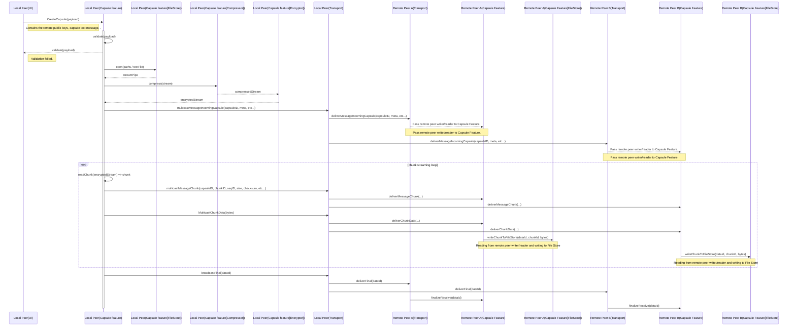

```mermaid
sequenceDiagram
    participant LPUI as Local Peer(UI)
    participant LPCF as Local Peer(Capsule feature)
    participant LPCFFS as Local Peer(Capsule feature[FileStore])
    participant LPCFCMP as Local Peer(Capsule feature[Compressor])
    participant LPENC as Local Peer(Capsule feature[Encryptor])
    participant LPTP as Local Peer(Transport)

    participant RPAT as Remote Peer A(Transport)
    participant RPACF as Remote Peer A(Capsule Feature)
    participant RPAFS as Remote Peer A(Capsule Feature[FileStore])

    participant RPBT as  Remote Peer B(Transport)
    participant RPBCF as Remote Peer B(Capsule Feature)
    participant RPBFS as  Remote Peer B(Capsule Feature[FileStore])

    LPUI->>LPCF: CreateCapsule(payload)
      Note right of LPUI: Contains the remote public keys, capsule text message,  .
    activate LPCF
    LPCF->>LPCF: validate(payload)
    LPCF-->>LPUI: validate(payload)
        Note right of LPUI: Validation failed.
    LPCF->>LPCFFS: open(paths / textFile)
    LPCFFS-->>LPCF: streamPipe
    LPCF->>LPCFCMP: compress(stream)
    LPCFCMP-->>LPENC: compressedStream
    LPENC-->>LPCF: encryptedStream

    LPCF->>LPTP: multicastMessageIncomingCapsule(capsuleID, meta, etc...)
    LPTP->>RPAT: deliverMessageIncomingCapsule(capsuleID, meta, etc...)
    RPAT-->>RPACF: Pass remote peer writer/reader to Capsule Feature.
        Note over RPAT,RPACF: Pass remote peer writer/reader to Capsule Feature.
    LPTP->>RPBT: deliverMessageIncomingCapsule(capsuleID, meta, etc...)
    RPBT-->>RPBCF: Pass remote peer writer/reader to Capsule Feature.
        Note over RPBT,RPBCF: Pass remote peer writer/reader to Capsule Feature.

    loop chunk streaming loop
        LPCF->>LPCF: readChunk(encryptedStream) => chunk
        LPCF->>LPTP: multicastMessageChunk(capsuleID, chunkID, seqID, size, checksum, etc...)
        LPTP->>RPACF: deliverMessageChunk(...)
        LPTP->>RPBCF: deliverMessageChunk(...)


        LPCF->>LPTP: MulticastChunkData(bytes)
        LPTP->>RPACF: deliverChunkData(...)
        LPTP->>RPBCF: deliverChunkData(...)


        RPACF->>RPAFS: writeChunkToFileStore(dataId, chunkId, bytes)
        Note over RPACF,RPAFS: Reading from remote peer writer/reader and writing to File Store
        RPBCF->>RPBFS: writeChunkToFileStore(dataId, chunkId, bytes)
        Note over RPBCF,RPBFS: Reading from remote peer writer/reader and writing to File Store


    end

    LPCF->>LPTP: broadcastFinal(dataId)
    LPTP->>RPAT: deliverFinal(dataId)
    LPTP->>RPBT: deliverFinal(dataId)
    RPAT->>RPACF: finalizeReceive(dataId)
    RPBT->>RPBCF: finalizeReceive(dataId)
    deactivate LPCF

```
